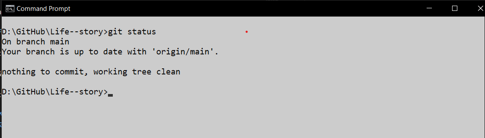
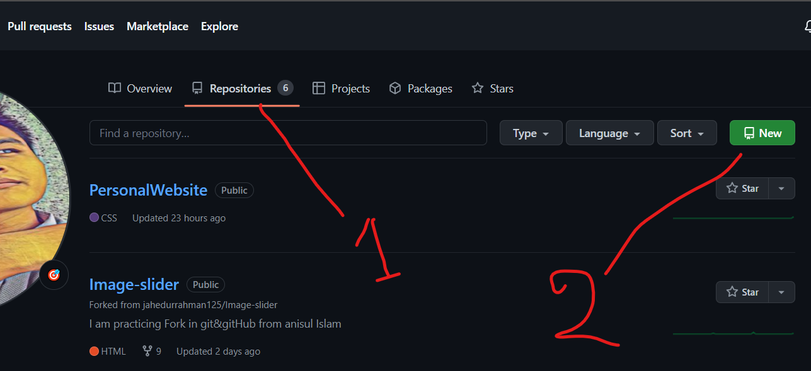
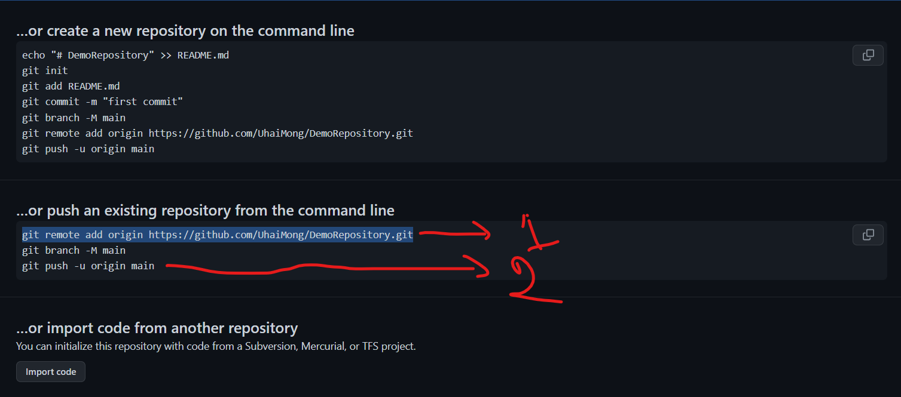
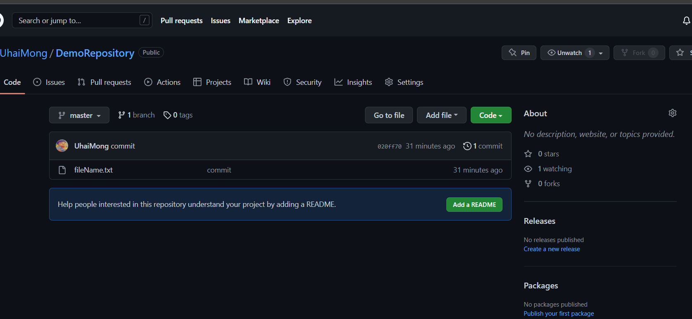
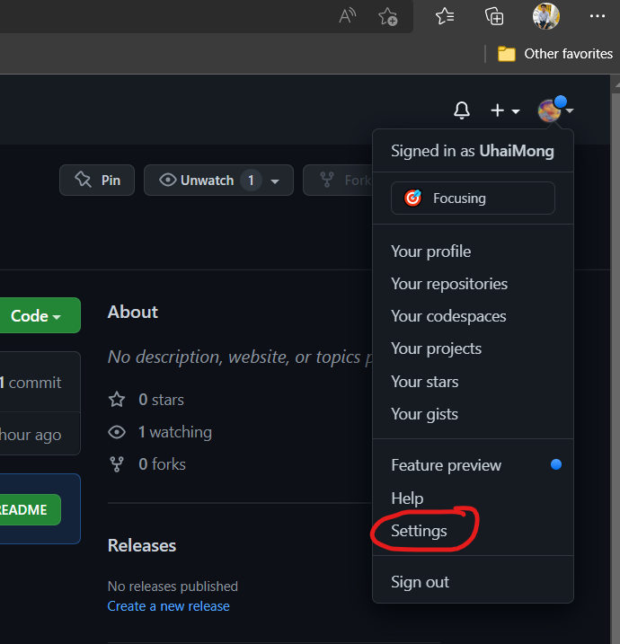
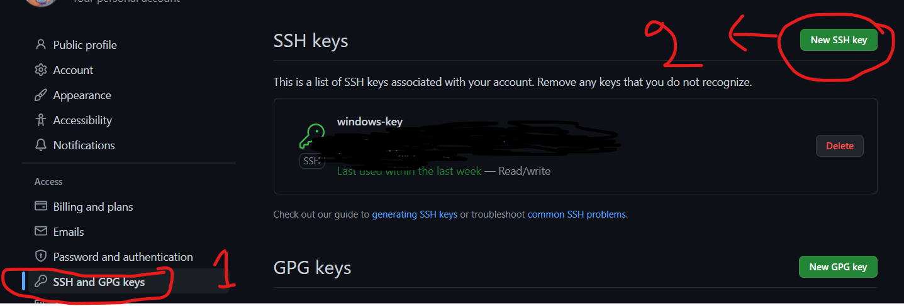
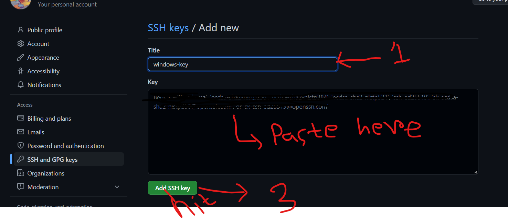
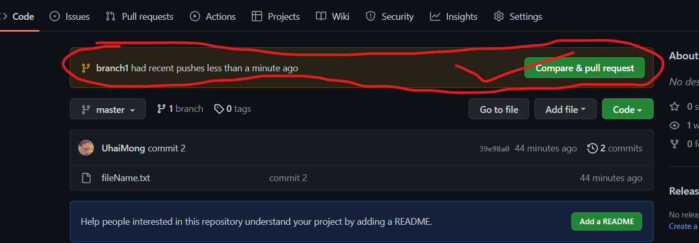
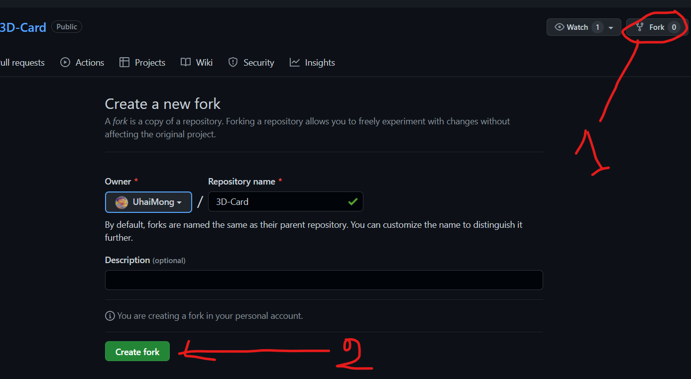
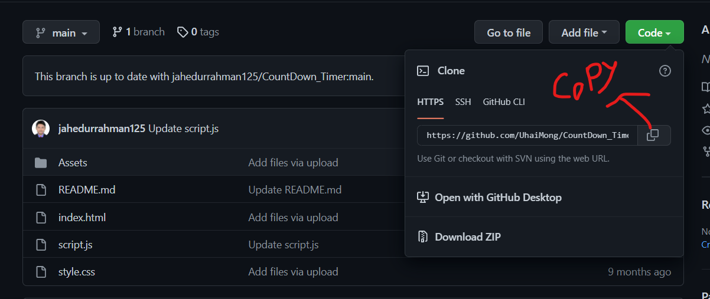

<!--Git & GitHub Tutorial-->
## Git & GitHub বাংলায় সহজ পাঠের সবাইকে স্বাগতম। সহজ উপায়ের গিট & গিটহাব শেখার জন্য নিচে লেখা গুলো পড়ো এবং নিজের পিসি বা কম্পিউটারে করার চেষ্টার করবেন।
<br>
<p>
    মূল পাঠের যাওয়ার আগে git & github সম্পর্কে কিছু জেনে নিন। এটা কাজ কি,
    এটার শেখার প্রয়োজনীয়তা কি, কেন আমরা এটা শিখবো।
    প্রথমে আলোচনা করি --
</p>

## Git কি?
<p>
    Git হল একটি Source Code Version Control এবং Source Code Management System, অর্থাৎ আপনার কম্পিউটারে আগে কি কোড লিখেছেন এবং পরবর্তীতে তা কোথায় কোথায় পরিবর্তন করেছেন তার ভার্সন বা রিভিশন কন্ট্রোল এবং ভার্সন বা রিভিশন অনুযায়ী সংরক্ষণ করার একটি আদর্শ সিস্টেম।
    ২০০৫ সালে লিনাক্স কার্নেলের জন্য লিনাস টারভাল্ডস গিট ডিজাইন এবং ডেভেলপ করেন। জিএনইউ জেনারেল পাবলিক লাইসেন্স এর অধীন লিনাক্সের মত গিটও ওপেনসোর্স এবং এখন পর্যন্ত সফটওয়্যার ডেভেলপমেন্টের জন্য সবচেয়ে জনপ্রিয় ভার্সন কন্ট্রোল সিস্টেম।
</p> 

## GitHub কি?
গিটহাব হলো হোস্টিং সার্ভিস যেখানে আপনি আপনার কোড নিরাপদে সরক্ষন করতে পারবেন। তারমানে এটাই বুজাই যে গিট হলো একটি টুল যা ভার্সন বা রিভিশন কন্ট্রোল করে আর গিটহাব হলো একটি হোস্টিং সার্ভিস যেখানে আপনি কোড গুলো নিরাপদে সংরক্ষন করবেন। এটি বর্তমানে মাইক্রোসফট অধীনস্থ একটি কোম্পানি,২০১৮ সালে ৭,৫ বিলিয়ন ডলারে ক্রয় করে নেয়।
### এবার নিশ্চয় বুজে গেছেন একজন প্রোগ্রামার কিংবা সিএসসি স্টুডেন্ট হিসেবে এটা জানা কতটা গুরুত্বপূর্ণ।
তাহলে আর কথা না বাড়িয়ে চলুন শুরু করি। পিসিতে গিট ইনস্টলেশন,গিটহাব একাউন্ট খোলা নিয়ে আলোচনা করবো না কারণ একজন ছোট বাচ্চাও এ কাজটা করতে পারবে।
## গিট এ কিছু গুরত্বপূর্ণ কমান্ড।
---
প্রথমের আমরা লোকালের কাজ করবো।  
<br>

__Git Configuration করার জন্য নিচে কমান্ড গুলো দাও।__  
```css
git config --global user.name "YourName"
```
```css
git config --global user.email "YourEmailAddress"
```
__ঠিক মতো নাম ও ইমেইল সেট হয়েছে কিনা দেখতে--__
```
git config user.name
```
```
git config user.email
```
__আপনার পিসিতে যে Drive এ কাজ করতে চাও সেখানে মোভ করতে__
```
d:
```
___D drive এ যাওয়া হছে আপনি যেখানে কাজ করতে চাও সে Drive লিখুন।___

__একটা নতুন ফোল্ডার তৈরি করুন।__
```
mkdir folderName
```
__git init মানে হচ্ছে একটি নতুন রিপোজিটোরি(Repository) তৈরি করে ঐটাকে initial করা।__
```
git init
```
__তারপর একটা ফাইল তৈরি করি এবং কিছু লিখে সেভ করি।__  
3 ways to creat file for windows users

```
cd .> fileName.txt
call> filName.txt
break> fileName.txt
```
Linux or Mac user
```
touch fileName.txt
```
__to open file with command windows users__
```
fileName.txt
```
__to open file with command mac or linux users__
```
open fileName.txt
```
___(any file with extension,there I am showing only txt file)___  
__(Repository) তে ফাইল বা ফোল্ডার সংযুক্ত করার জন্য---__
```
git add fileName.txt
```
___or___
```
git add .
```
__Offline Repository তে স্থায়ীভাবে কাজ সংযুক্ত করার জন্য---__
```
git commit -m "Your commit"
```
add & commit একসাথে করার জন্য---
```
git commit -am "your commit"
```
__আপনার প্রজেক্ট বা কাজ অফলাইন রিপোজিটোরিতে যুক্ত হয়েছে কিনা দেখতে--__
```
git status
```
নিচে ছবি মতো দেখাবে-----


__কোনো কোড কিংবা কোনো নতুন লাইন যুক্ত করলে প্রতিবারে add & commit করতে হবে তা না হলে আপনার এডিট করা কোড কিংবা লাইন আপনার রিপোজিটোরিতে সংযুক্ত হবে না।__
## Local repository and Remote Repository or GitHub এ সাথে সংযুক্ত করা---
___

### প্রথমের আপনার গিটহাব একাউন্ট এ গিয়ে একটি নিউ রিপোজিটোরি তৈরি করতে হবে। এটা করার জন্য নিচে ছবিটা অনুসরন করুন--


__Remmote repository সাথে সংযুক্ত করার জন্য ---__  
<br>
চেক করে নিতে ।
```
git remote
```

__নিচে ছবি মতো আপনার রিমোট রিপোজিটোরি ১নং কমান্ড টা কপি করে নিচে পেস্ট করুন।__

```
git remote add origin git remote add origin git remote add origin https://github.com/UhaiMong/DemoRepository.git
```


__এরপর ২নং চিহ্নিত কমান্ড টা কপি করে পেস্ট করুন। main এর স্থলে master লিখুন master থাকলে চেঞ্জ করতে হবে না।__
```
git push -u origin master
```
__GitHub একাউন্ট এ Repository page কে refresh করুন নিচে ছবি মত দেখাবে। তারমানে আপনার লোকাল রিপোজিটোরি সাথে রিমোট রিপোজিটোরি সংযুক্ত হয়ে গেছে।__
<br><br>


### অনেক সময় এ পর্যায়ে access denied প্রব্লেম হতে পারে এক্ষেত্রে কি করবেন? নিচে কমান্ড এবং ধাপ গুলো অনুসরন করুন।
__কমান্ড এবং হিট Enter আর যাদের সফলভাবে যুক্ত করতে পারছেন তারা স্কিপ করুন।__
```
ssh-keygen
```
Your public key has been saved in C:\Users\uhaim/.ssh/id_rsa.pub.  
এ Path এ গিয়ে id_rsa.pub টা ওপেন করে সব লেখা কপি করুন তারপর আপনার গিটহাব একাউন্ট এ গিয়ে নিচে ছবি মতো অনুসরন করুন।


<br><br>

<br><br>


## I hope access denied problem will be solved.  

### লোকাল রিপোজিটোরিতে কোড বা কোনো কিছু এডিট কিংবা নতুন লাইন যোগ করলে রিমোট রিপোজিটোরিতে সেটা কিভাবে আনবো?
<br>

# Command line
```
git add . or git add fileName.txt
git commit -m "your commit"
git status          <to check status>
git push -u origin main or master
git log --oneline   <to show history of commit in details>
```
### Remote রিপোজিটোরিতে কোড বা কোনো কিছু এডিট কিংবা নতুন লাইন যোগ করলে Local রিপোজিটোরিতে সেটা কিভাবে আনবো?

# Command line
```
git pull                <upgrading file frome remote to local>
git log --oneline       <check your commit>
git fileName.txt        <check where you changed code in remote repository>
```
__রিপোজিটরি(repository) তে নতুন branch তৈরির প্রয়োজন হয়। সাধারনভাবে main or master branch তে কাজ করি। প্রয়োজন অনুসারে আরও branch তৈরি কিভাবে করব?।__
# Command line
```
git branch                  <check how many branch created>
git branch "branchName"     <creat new branch>
git checkout branchName     <switching branch>
git branch -d branchname    <delete branch>
git checkout -b "branchName <creat & switching created branch>
git fileName.txt            <add some code or line>
git commit -am "your commit"
git push -u origin branchName <push to remote repository>
git log --oneline           <commit history show>
```
__আপনার গিটহাব একাউন্ট এ একটা pull request আসবে। সেটা accept করলে নতুন branch এ চেঞ্জ গুলো Remote repository তে চলে যাবে।__
<br><br>


## লোকালের branching এবং merging করে সেগুলোকে  remote repository তে push করে দিব।
# Command line
```
git checkout -b "branch2"           <any name>
git fileName.txt                    <add some text or code>
git status                          <check status>
git commit -am "commit 4"           <added and commit same time>
git checkout master or main         <switching to master or main>
git merge branch2                   <merge to master or main branch> 
git pull                            <*** you must to pull to local repo. previous change>
git push -u origin master or main
```
### অন্য একাউন্ট এ কোনো প্রজেক্ট কিংবা কোড হুবহু কপি নিজে পিসি তে এনে কিভাবে কাজ করবো? প্রথমে আপনাকে ঐ একাউন্ট এ যেতে হবে , যেখান থেকে আপনি ক্লোন করতে চান। নিচে ছবিতে দেখুন। 
<br><br>


__এরপর নিজে একাউন্টের ঐ রিপোজিটোরি কোডের url টা কপি করুন।__
<br><br>


# Command line
```
git clone url       <download a copy from remote repository>
dir                 <check directory that you have cloned>
cd ..               <go to backward>
cd FolderName       <change directory>
code .              <open the code on Vscode>
```

# Thank you everyon🙏🏻🙏🏻
<br><br>

# Contact me
[facebook][Facebook]<br>
[linkedin][LinkedIn]<br>
[website][Website]

<!--All link here-->
[facebook]:https://www.facebook.com/uhaisingmarma.uhai
[linkedin]:https://www.linkedin.com/in/uhai-marma-1a64b51ba?lipi=urn%3Ali%3Apage%3Ad_flagship3_profile_view_base_contact_details%3Bgom4KzxVRkK2GB1Toeo4og%3D%3D
[website]:https://uhaimong.github.io/PersonalWebsite/


